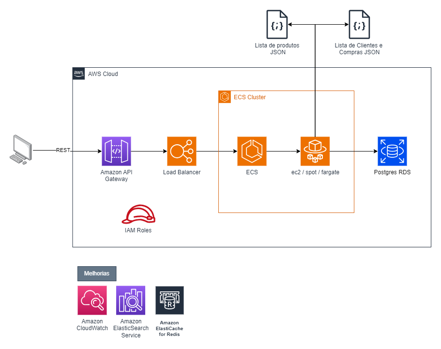
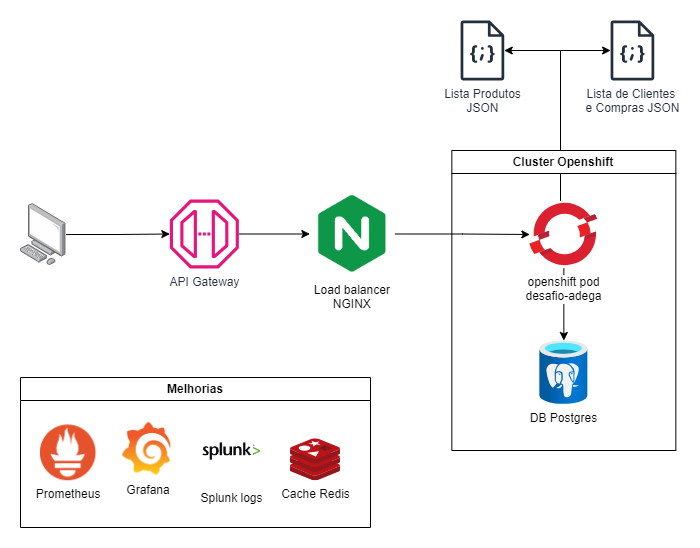

# Desafio Adega

## Descrição

Este projeto foi concebido para avaliação técnica e validação de novas tecnologias.

Crie um microserviço com os seguintes endpoints após consumir os dados dos mocks acima e retorne o que está sendo solicitado:

- GET: `/compras` - Retornar uma lista das compras ordenadas de forma crescente por valor, deve conter o nome dos clientes, cpf dos clientes, dado dos produtos, quantidade das compras e valores totais de cada compra.
- GET: `/maior-compra/ano` - (Exemplo: /maior_compra/2016) - Retornar a maior compra do ano informando os dados da compra disponibilizados, deve ter o nome do cliente, cpf do cliente, dado do produto, quantidade da compra e seu valor total.
- GET: `/clientes-fieis` - Retornar o Top 3 clientes mais fieis, clientes que possuem mais compras recorrentes com maiores valores.
- GET: `/recomendacao/cliente/tipo` - Retornar uma recomendação de vinho baseado nos tipos de vinho que o cliente mais compra.

## Funcionalidades

- [x] Consumir dados dos JSON e armazenar em um banco de dados
- [x] Lista de compras
- [x] Buscar maior compra do ano
- [x] Lista top 3 clientes fieis
- [x] Buscar recomendação de vinho

### Tarefas

- [X] Integração com serviço externo JSON
- [X] Documentação API
- [x] Versionamento da API com Swagger
- [x] Testes unitários
- [x] Collections Postman
- [x] Desenho de solução em nuvem aws (IaaS)
- [x] Desenho de solução em openshift (PaaS)
- [ ] Testes automatizados
- [ ] Tratamento de erros
- [ ] Testes de performance (JMeter)
- [ ] Observability (prometheus, grafana)

## Stack

- Java 22
- Spring Boot 3.3.0
- Banco de dados Postgres
- Testes com JUnit, Mockito
- Documentação da API com Swagger/OpenApi
- Lombok
- Docker-compose

## Documentação Swagger

A documentação da API está disponível através do Swagger UI, acessível em `/api/swagger-ui/index.html` após iniciar a aplicação.

## Desenho de Solução

### Solução de arquitetura em AWS

### Solução de arquitetura com openshift (PaaS)

